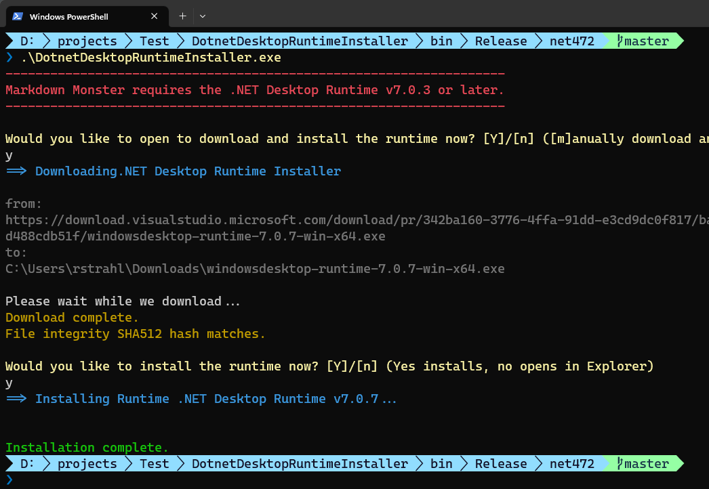

Dotnet Desktop Runtime Downloader and Installer
-----------------------------------------------

This project creates a tiny Windows Console executable that can be shipped with a .NET Core application **to ensure that a minimum version of the Desktop Runtime is installed**. 

The idea is that you can build a custom version of this executable and ship it with your application, and fire it from your installer or install script to install the required minimum runtime if not already present. The tool checks for the minimum version, and if not present downloads and installs it.

> You can also customize this project to act as a launcher that checks for the Runtime and installs it if not present and then forwards the command line to your main .NET Core executable. But this is not built into this project.

The executable does the following:

* Checks for a minimum .NET Desktop Runtime Version
* If installed does nothing and exits
* If not installed prompts to download the latest runtime (latest patch)
* Prompts to install the downloaded runtime running as Admin
* Optionally can run without prompts using the `-silent` commandline switch
* Runs on .NET 4.72 so it has no dependencies on Windows (single EXE)

Here's what it looks like in interactive mode:



## Silent Mode
The figure above shows the installer running in interactive mode, which prompts for download, and installation explicitly. 

If you'd rather run the installer silently, for example when you are calling it from an installer or script you can use the `-silent` switch:

```ps
.\DotnetDesktopRuntimeInstaller -silent
```

## Sample Project
This project is meant as a sample template project that you can customize and rename or copy into your own solutions for distribution. You can and probably should rename the executable to an application specific launcher name or integrate it into an existing launcher. For example, I have this code integrated into a `mm.exe` which is the Markdown Monster alternate launcher that otherwise forwards commands to the main executable, but performs several support tasks.

## Configuration
In order for this tool to work **you have to specify a few things** that determine what versions are checked for and are downloaded. You need to specify:


* An application name (for prompts)
* A minimum version you need to have supported (ie. 7.0.3)
* A direct download URL (from MS site)  
<small><i>([from here](https://dotnet.microsoft.com/en-us/download/dotnet/7.0) - choose x64 Desktop Runtime and follow to the download link)</i></small>
* An optional SHA512 has of the file content

You can configure these values in `DesktopRuntimeInstaller.cs` in the `RuntimeConfiguration` class:

```csharp
internal class RuntimeConfiguration
{
        internal static string ApplicationName = "Markdown Monster";

        /// <summary>
        /// Minimum version of the Desktop Runtime that's supported.
        ///
        /// Launcher checks for installed version and if lower prompts
        /// to install it.
        /// </summary>
        internal static string MinDotnetRuntimeVersion { get;  } = "7.0.3";

        /// <summary>
        /// Direct download URL for the .NET Desktop Runtime Installer.
        /// 
        /// Recommend you update this link to the latest available patch version so if you need to install
        /// you are installing the latest, not an older version.
        /// MM allows patch roll forward meaning later patches work but you don't install if a
        /// a compatible version is already installed.
        /// 
        /// Get this URL from the Microsoft .NET download site:
        /// https://dotnet.microsoft.com/en-us/download/dotnet/7.0 (Download x64 Desktop Runtime)
        /// </summary>
        internal static string DesktopRuntimeDownloadUrl { get;  } =
            "https://download.visualstudio.microsoft.com/download/pr/342ba160-3776-4ffa-91dd-e3cd9dc0f817/ba649d6b80b27ca164d80bd488cdb51f/windowsdesktop-runtime-7.0.7-win-x64.exe";

        /// <summary>
        /// Optional SHA512 hash of the downloaded file to verify the file integrity.
        ///
        /// Checked only if the value is set.
        /// </summary>
        internal static string DownloadExeSha512 { get; } = "d59e8716324bd8973a95a9fd42a58ad0b176f4b37e8b8ba732be0e13d6f7ffdea79a52aa98363ec86860d551e124bdfaf71ac979b8f41f398e668fd12aa8483e";
}
```

## Resources


* [Related Blog Post](https://weblog.west-wind.com/posts/2023/Jun/21/Creating-a-Runtime-Checker-and-Installer-for-a-NET-Core-WPF-Application)
